# A R Interface to [ECharts 3.0](https://github.com/ecomfe/echarts)


**This package is <font color=red>under development</font>, more features will be added.**

**这个包目前在<font color=red>开发中</font>。**


## Installation

```r
devtools::install_github('ChanningWong/REcharts3')

```

## Examples

```r
library(REcharts3)
```


### Bar Plot

```r
dat1 = aggregate(weight ~ feed, data = chickwts, mean)
bar(dat1, feed, weight, label = round(weight, 0), title = 'test')

dat2 = aggregate(breaks ~ wool + tension, data = warpbreaks, mean)
bar(dat2, wool, breaks, tension, label = round(breaks*10, 0), title = 'test')

his(esoph, agegp, ncontrols, alcgp, facets = tobgp, title = 'Data Set Esoph')

```

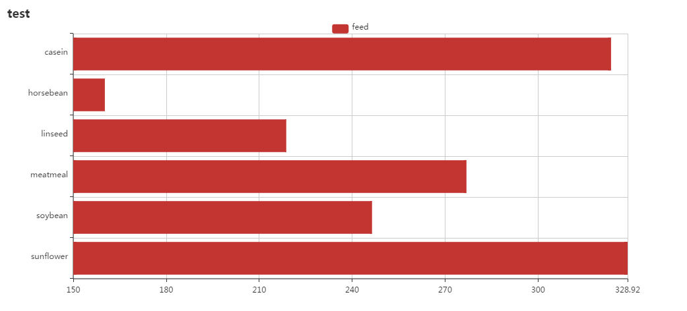

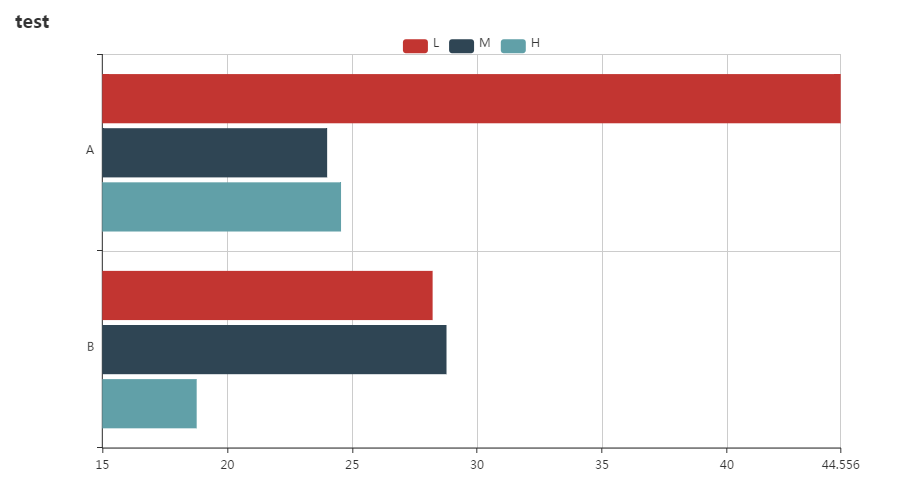

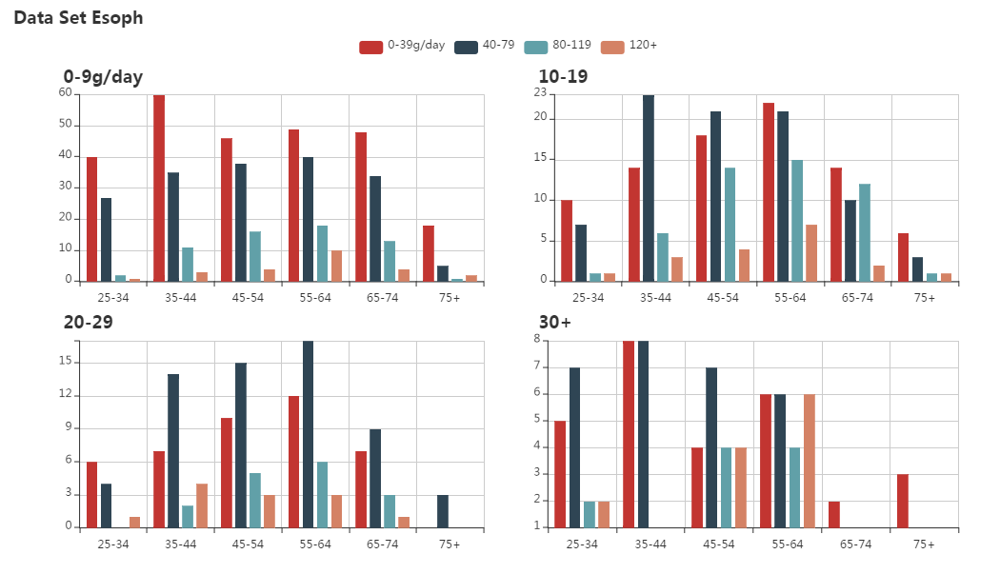


### Line Plot

```r
line(airquality[1:20, ], paste0(Month, '-', Day), Temp, title = 'airquality')
```

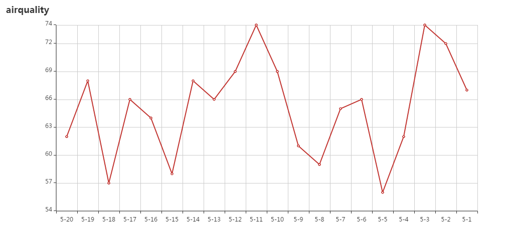


### Pie Plot

```r
dat1 = aggregate(weight ~ feed, data = chickwts, mean)
pie(dat1, feed, weight, label = round(weight*10, 0), title = 'Pie Plot')
donut(dat1, feed, weight, title = 'Pie Plot')
```

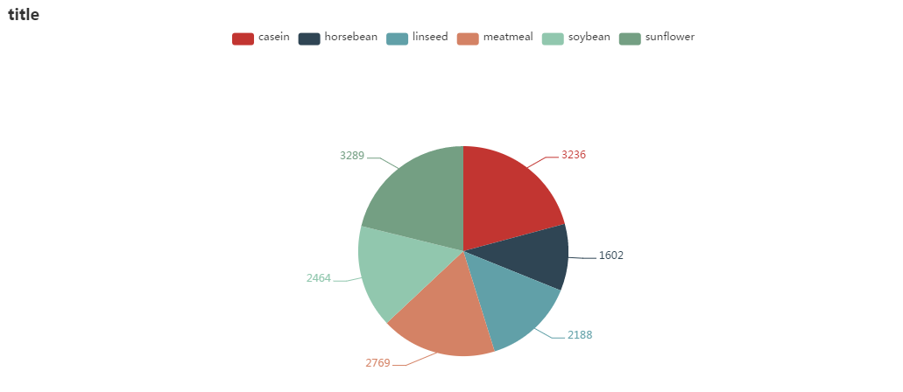
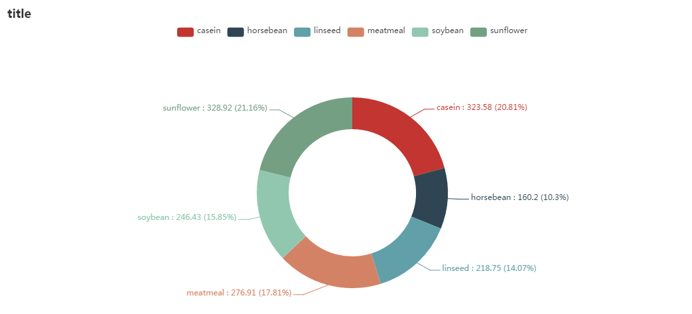


### Scatter Plot

```r
warpbreaks$x1 = runif(nrow(warpbreaks))
warpbreaks$y1 = runif(nrow(warpbreaks))
scatter(warpbreaks, x1, y1, wool, paste0('tension: ', tension), title = 'Scatter Plot')
```

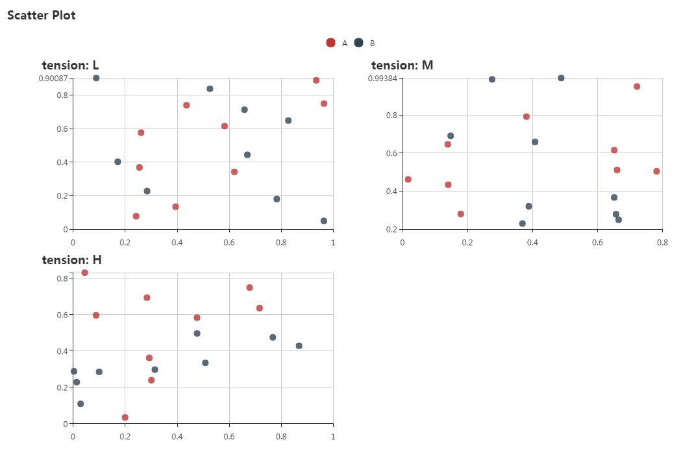


### Mixed Plot

```r
library(tidyr)
y = runif(10, min = 1, max = 10)
dat = data.frame(x = LETTERS[1:10])
dat$proportion = y / sum(y)
dat$CumulativeProportion = cumsum(dat$proportion)
dat2 = gather(dat, key, value, -x)

p = his(dat2, x, value, key, label = percent(value, 0), 
        title = 'test', label.show = T, label.position = 'top', yAxis.max = 1)
p2 = p %>% addSecAxis(series = 'CumulativeProportion', type = 'line', yAxis.max = 1)
p2
```

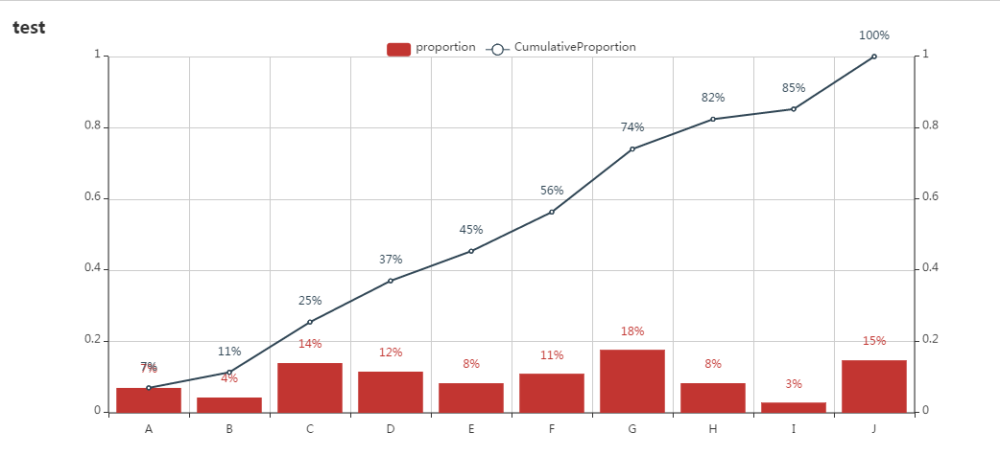


### Map Plot
```r
dat1 = data.frame(
  n = 1:10,
  type = rep(c('day1', 'day2'), each = 5),
  rbind(c(120.210813,27.321733), c(120.220813,27.321733), c(120.230813,27.351733),
        c(120.220813,27.351733), c(120.230813,27.311733), c(120.215,27.322),
        c(120.220,27.323), c(120.230,27.350), c(120.220,27.352), c(120.230,27.312)))
names(dat1) = c('n', 'type', 'lng', 'lat')

mapLines(dat1, 'lng', 'lat', 'type', title = '行程',
        center = c(dat1$lng[1], dat1$lat[1]), color = c('red', 'blue'),
         effect = list(show = T, constantSpeed = 100, symbol = 'circle', trailLength = 0.2, symbolSize = 5))
```

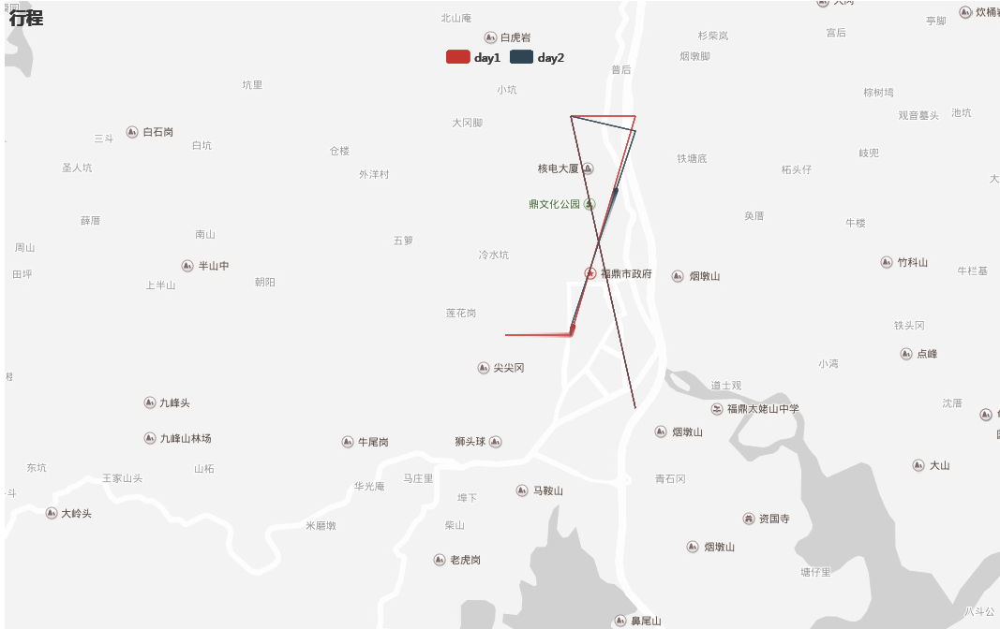

<br>


## Shiny APP

```r

library(REcharts3)
library(shiny)

shinyApp(
  ui = fluidPage(
    numericInput("n", "n", 1),
    RCharts3Output('plot'),
    RCharts3Output('plot2')
  ),
  
  server = function(input, output) {
    
    
    output$plot <- renderREcharts3( {
      dat_test = aggregate(breaks ~ wool + tension, data = warpbreaks, mean)
      p0 = bar(dat_test, wool, breaks, tension, label = round(breaks*10, 0), stack = T, 
               title = 'test1', height = 300)
      p0
    })
    
    output$plot2 <- renderREcharts3( {
      dat_test2 = aggregate(weight ~ feed, data = chickwts, mean)
      p02 = pie(dat1, feed, weight, title = 'test2', height = 400)
      p02
    })
    
  }
)

```

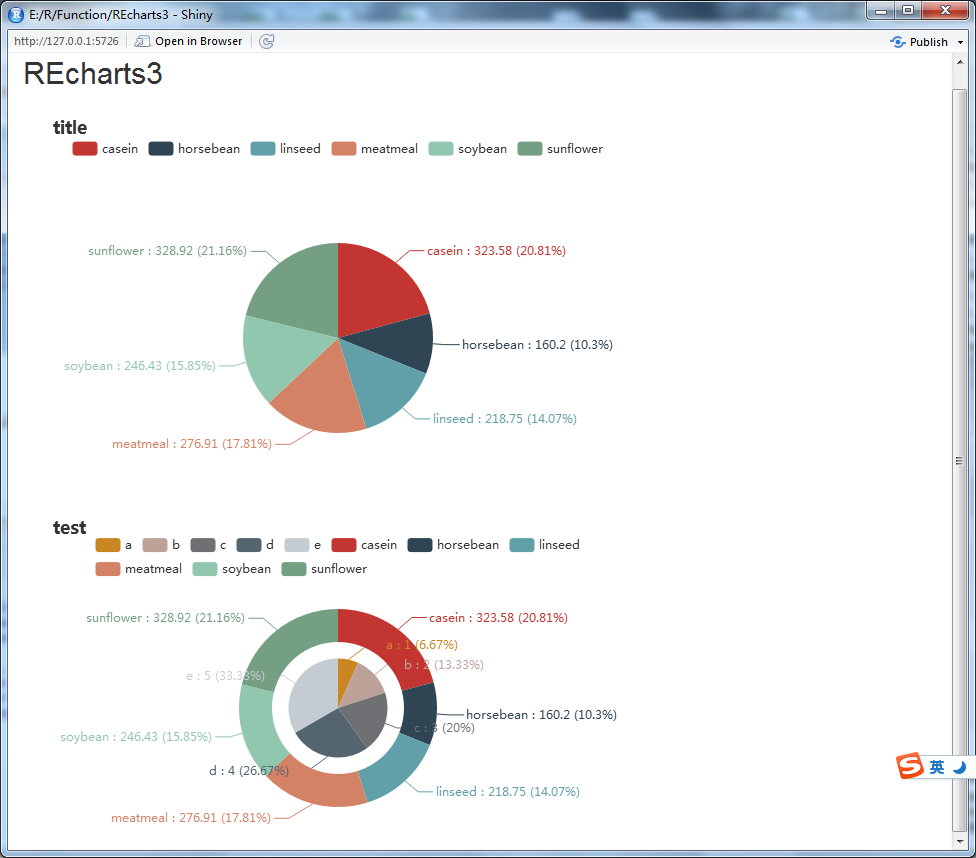

<br>


## RMarkdown

```
library(REcharts3, warn.conflicts = F, verbose = F, quietly = T)

incluedRECharts3()

p = line(esoph, agegp, ncontrols, alcgp, facets = tobgp, title = 'Data Set Esoph')
RECharts3Knit(p, width = 900, height = 600)

```

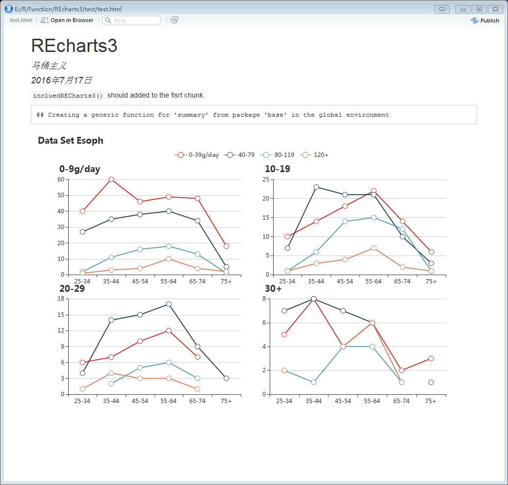


